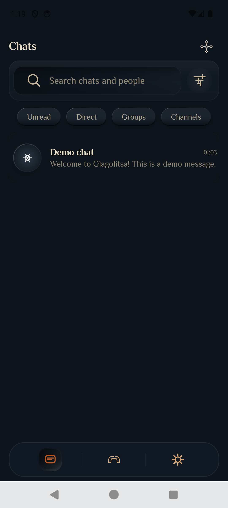
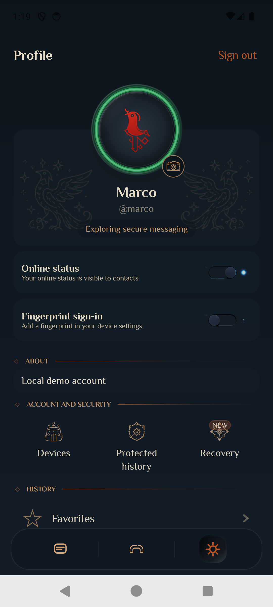
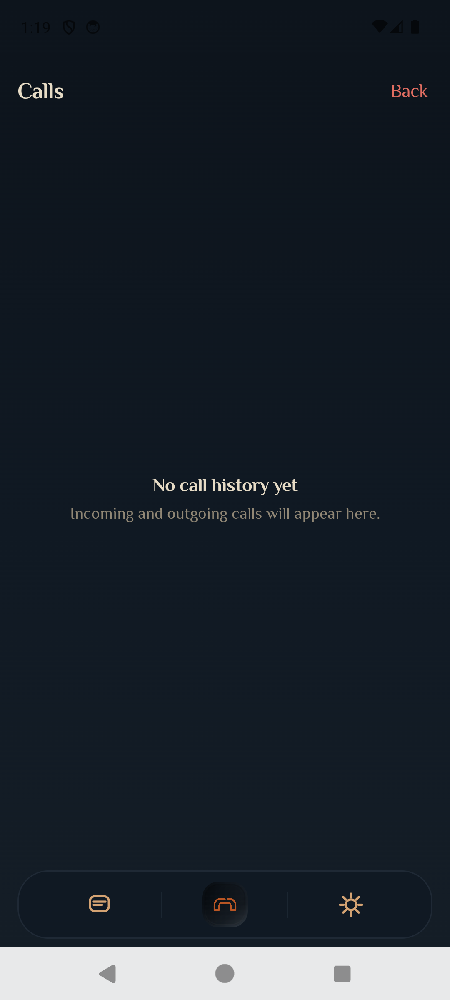

# Glagolitsa

[English](README.md) · [Русский](README.ru.md)

Glagolitsa is an independently developed cross-platform messenger for private messaging, groups, channels, and voice calls. The repository contains Android, iOS, and desktop clients alongside a self-hosted Go backend.

The project is under active development. Android currently has the most complete feature set; iOS and desktop support are progressing. The implementation, architecture, deployment tooling, and automated tests are published here as an engineering portfolio project.

There is no hosted public service included with the repository. You can run the backend locally with Docker or deploy it to your own infrastructure. The `api.glagolit.me` domain found in the code identifies the author's deployment target; it does not imply that a public service is available.

## Screenshots

<p align="center">
  
  
  
</p>

## Current capabilities

| Area | Security model | Current support |
|------|----------------|-----------------|
| Direct messages and private groups | End-to-end encryption using Signal Protocol through libsignal | Android; iOS when LibSignal is linked. The desktop crypto engine is currently a placeholder |
| Channels | Not end-to-end encrypted; the server can read channel content | All clients |
| One-to-one calls | Android creates the media key on-device and supplies it to LiveKit E2EE, with DTLS-SRTP also protecting transport to the SFU | Android publishes audio to the room. iOS has the call UI, but its room media layer is not connected yet |
| Long-distance connectivity | TURN over UDP/443 and TURNS/443 for NAT traversal and networks that restrict ordinary WebRTC traffic | Available when the RTC edge in `server/deploy/rtc/` is deployed |

A channel is not a private chat. Internet calls also require a self-hosted LiveKit and TURN deployment so that clients can obtain room tokens and ICE configuration.

## Technology

- Kotlin Multiplatform and Compose Multiplatform
- Ktor client with a Go API
- libsignal for direct and private-group messaging
- LiveKit and coturn for calls
- PostgreSQL, with optional Redis and file-backed attachment storage

## Repository structure

```text
glagolitsa-mobile/
├── shared/       shared UI, API, cryptography, and calling code
├── androidApp/   Android application
├── iosApp/       iOS application
├── desktopApp/   desktop application
├── server/       Go API, migrations, deployment, and RTC services
├── maestro/      optional UI smoke tests
└── docs/         architecture documentation
```

## Run locally

You need Docker, JDK 17, and the Android SDK for an emulator or physical device.

```bash
./scripts/run-and-debug.sh --server-only   # PostgreSQL + local API
./scripts/run-and-debug.sh                 # local API + Android
./scripts/run-and-debug.sh --ios           # iOS Simulator + local API
```

| Client | Local API address |
|--------|-------------------|
| Android Emulator | `http://10.0.2.2:8080` |
| iOS Simulator | `http://127.0.0.1:8080` |
| Custom deployment | `-PapiBaseUrl=https://your.api` or `apiBaseUrl` in `local.properties` |

`local.properties` is excluded from Git. It can also contain `apiFallbackIp`, an optional fallback API address used when DNS resolution fails. No real fallback address is included in this repository.

For Android push notifications, copy `androidApp/google-services.json.example` to `androidApp/google-services.json` and provide your own Firebase project configuration. The application builds without this file, but push registration remains disabled. A real `google-services.json` is never committed.

For self-hosted calls, see [server/deploy/rtc/README.md](server/deploy/rtc/README.md). An example API environment is available at [server/deploy/production.env.example](server/deploy/production.env.example). Deployment scripts do not contain a server IP; provide `VPS_HOST` and `PUBLIC_HOST` yourself.

Local development accounts are Marco and Polo, defined in `scripts/lib/dev-accounts.sh`. Their credentials are not embedded in release builds.

## Verification

| Scope | Command |
|-------|---------|
| Client unit tests and Go server tests | `./scripts/pr-check.sh` |
| Client only | `./scripts/test-unit.sh` |
| Server only | `./scripts/test-server.sh` |
| Live local API | `./scripts/test-messaging.sh --live-local` |

Server tests run against the code in `server/`. Maestro UI smoke tests are optional; see [maestro/README.md](maestro/README.md).

## License and usage

The code is distributed under the **[Glagolitsa Source Available License](LICENSE)**. It is a source-available license inspired by the [Mattermost Source Available License](https://docs.mattermost.com/product-overview/faq-mattermost-source-available-license.html); it is not an OSI-approved open-source license such as MIT, Apache, or GPL.

| Permitted | Requires separate permission |
|-----------|------------------------------|
| Reading, studying, and forking the source | Selling the code or a derived product |
| Running and modifying it for non-commercial use | Operating it as a paid or hosted service |
| Development, evaluation, and testing, including within a company | Commercial production use |
| Redistribution while preserving the license | Removing attribution or presenting the code as your own |

**Attribution is required** to Svetlana Zavatskaia / Glagolitsa (`https://github.com/LanaZet/glagolitsa-mobile`): keep this `LICENSE` and the source headers, and retain the attribution on the application's About screen.

For commercial licensing, contact the author through [github.com/LanaZet](https://github.com/LanaZet).

### libsignal and binary distribution

This repository integrates `libsignal` **0.96.4**:

- Android: `org.signal:libsignal-android` and `org.signal:libsignal-client`;
- iOS: `LibSignalClient` from `https://github.com/signalapp/libsignal.git`, tag `v0.96.4`.

`libsignal` is distributed under **GNU AGPL-3.0**. This repository can publish its original source under the Glagolitsa Source Available License because libsignal is not copied into the repository and is retrieved as an external build dependency.

APK, IPA, or desktop binaries that include libsignal cannot be distributed as a product solely under the Glagolitsa Source Available License. Such distribution must comply with AGPL-3.0 for the complete linked program, replace or remove libsignal, or use separate permission from libsignal's rights holder.

This does not change the license of Glagolitsa's original source code, but it does constrain the distribution of binaries containing the AGPL dependency.

The Philosopher font in `shared/src/commonMain/composeResources/font/` is distributed under the **SIL Open Font License 1.1**. Its license is stored alongside the font as [`OFL.txt`](shared/src/commonMain/composeResources/font/OFL.txt).

Source files use the following header:

```text
// Copyright (c) 2026-present Glagolitsa contributors. All Rights Reserved.
// See LICENSE for license information.
```

- [`LICENSE`](LICENSE) · [`NOTICE`](NOTICE) · [`SECURITY.md`](SECURITY.md)
- Apply headers manually: `./scripts/add-license-headers.sh`
- Verify headers: `./scripts/add-license-headers.sh --check`
- Install the hook for new files: `./scripts/install-git-hooks.sh`

## Documentation

Documentation index: **[docs/README.md](docs/README.md)**

| Topic | Document |
|-------|----------|
| Architecture overview | [docs/architecture/overview.md](docs/architecture/overview.md) |
| Direct messages, groups, and channels | [docs/architecture/conversations.md](docs/architecture/conversations.md) |
| Channels | [docs/architecture/channels.md](docs/architecture/channels.md) |
| Calls | [docs/architecture/calls-stability.md](docs/architecture/calls-stability.md) |
| RTC edge | [server/deploy/rtc/README.md](server/deploy/rtc/README.md) |
| Security boundaries | [SECURITY.md](SECURITY.md) |
| iOS | [docs/ios/README.md](docs/ios/README.md) |

## Author

Glagolitsa is designed and developed by **Svetlana Zavatskaia** as an independent engineering project spanning mobile clients, backend services, applied cryptography, real-time communications, deployment, and test automation.

I am open to conversations about mobile, Kotlin Multiplatform, and backend engineering opportunities.
